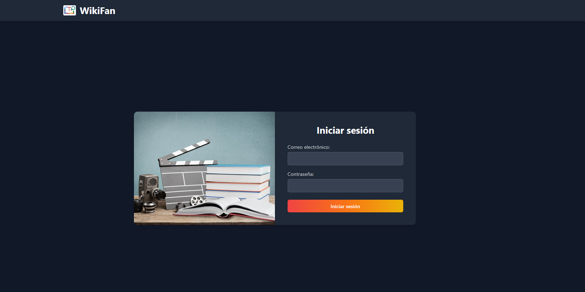
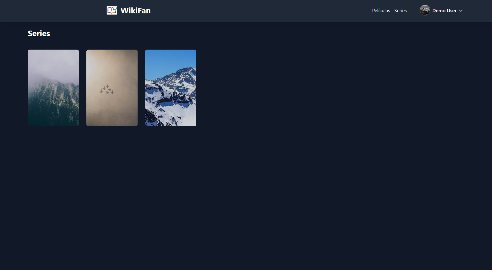
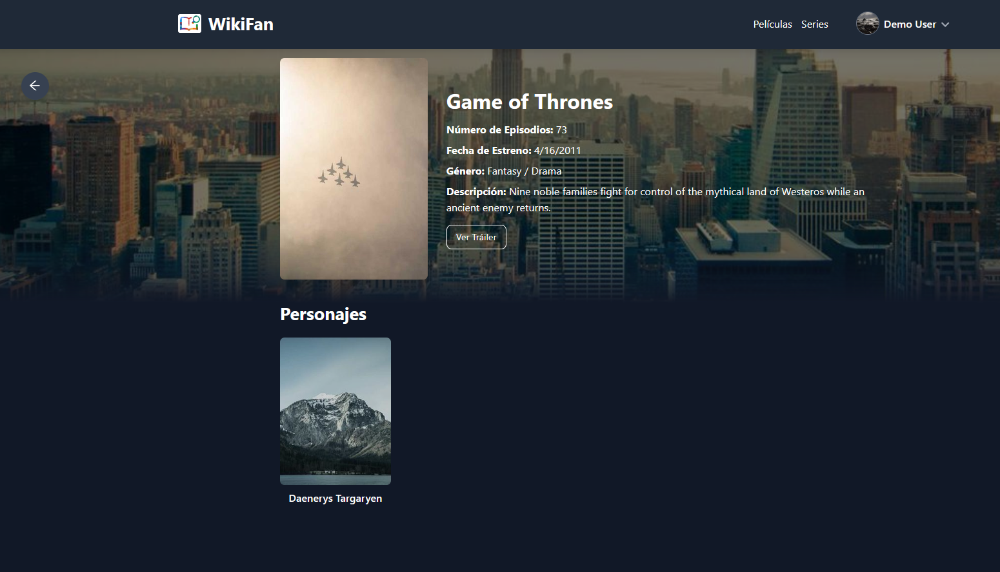

# Vista de la Aplicación

Esta sección muestra las pantallas principales del cliente de WikiFan.

---

## Inicio de sesión

Pantalla de autenticación donde el usuario ingresa sus credenciales para acceder a la aplicación.

{ width="100%" }

---

## Listado de películas y series

Vista principal que muestra el catálogo de contenido disponible. Desde aquí el usuario puede explorar y filtrar películas y series.

{ width="100%" }

---

## Detalle de película o serie

Vista de detalle con la información completa de una película o serie seleccionada: descripción, actores, personajes y más.

{ width="100%" }
